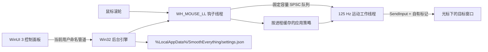

# SmoothEverything

SmoothEverything 是一个面向 Windows 10/11 的原生滚轮平滑工具。它以低延迟 Win32 后台引擎捕获传统鼠标滚轮输入，在独立工作线程中生成 125 Hz 平滑帧，并提供 WinUI 3 控制面板管理手感、应用规则和诊断信息。

当前版本：`0.1.0`（x64 预览版）。

## 已实现

- 全局纵向与横向滚轮平滑，Shift + 滚轮可转为横向滚动。
- 五次平滑曲线、距离、动画时长、连续滚动加速和长尾比例调节。
- 反向输入立即取消旧动量，鼠标跨窗口时取消当前手势。
- 按可执行文件名排除应用，或为应用保存独立运动参数和兼容模式。
- Ctrl / Alt 组合键放行，以及高分辨率小增量输入放行。
- 当前用户登录启动、通知区域菜单和 `Ctrl + Alt + S` 快速开关。
- WinUI 3 控制面板：主页、应用规则、高级选项、实时诊断。
- 同一用户可访问的命名管道热更新；配置采用原子替换保存。
- 队列溢出、目标不可访问或输入注入失败时直接放行原始滚动。

SmoothEverything 不扫描、不检测、也不会终止其他滚动软件。若同时运行多个全局滚动工具，效果可能叠加，应由用户自行选择运行组合。

## 架构



钩子回调只做常数时间判断、缓存读取和入队；进程路径解析、曲线采样、计时与 `SendInput` 均在钩子线程之外完成。详见 [架构说明](docs/architecture.md)。

## 构建

要求：Windows 10 2004 或更高版本、PowerShell 7、Scoop。所有需要安装的工具链均通过 Scoop：

```powershell
pwsh .\scripts\Setup-Toolchain.ps1
pwsh .\scripts\Build.ps1 -Configuration Debug
```

如果本机 NuGet HTTPS 握手异常，可先通过 Scoop 安装 aria2：

```powershell
pwsh .\scripts\Setup-Toolchain.ps1 -IncludeNetworkWorkaround
```

本仓库的构建脚本会优先使用工作区 `.nuget-feed` 中已存在的本地包；正常环境直接从 `NuGet.Config` 声明的 nuget.org 官方源还原。

发布自包含 x64 压缩包：

```powershell
pwsh .\scripts\Publish.ps1
```

输出位置：

- 原生构建：`artifacts/build/<debug|release>`
- 发布目录：`artifacts/publish/win-x64`
- 压缩包：`artifacts/SmoothEverything-0.1.0-win-x64.zip`

## 运行

在同一发布目录中运行 `SmoothEverything.ControlPanel.exe`。如果后台引擎不在线，控制面板会启动同目录的 `SmoothEverything.Engine.exe`；也可以直接运行引擎并从通知区域打开控制面板。

配置文件位于：

```text
%LocalAppData%\SmoothEverything\settings.json
```

控制面板异常日志位于同目录的 `settings-crash.log`。配置字段说明见 [配置说明](docs/configuration.md)。

## 安全与平台边界

- 默认不申请管理员权限，不安装驱动或系统服务。
- 只处理当前交互用户会话；不会作用于登录界面、UAC 安全桌面或 BitLocker/TPM 预启动环境。
- 受 Windows UIPI 完整性级别限制，普通权限进程不能可靠注入管理员权限窗口；此时采用放行策略。
- 鼠标事件、窗口句柄和 RSSI 类似的环境信号都不是身份凭证；本项目不把滚轮输入用于任何认证目的。
- 当前发布物未签名，只建议在可审查的本地构建或测试环境使用。

## 当前限制

- 仅构建和验证 x64。
- 高分辨率设备判断目前基于滚轮增量小于 `WHEEL_DELTA` 的保守启发式，而不是厂商或设备白名单。
- 第一次遇到未缓存的目标进程时，该次滚轮事件会原样放行；路径解析完成后才应用对应策略。
- 预览版暂不提供安装器、代码签名或自动更新。
