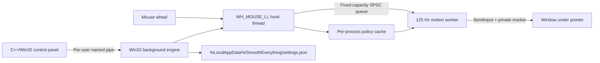

# SmoothEverything

SmoothEverything is a native mouse-wheel smoothing utility for Windows 10 and 11. Its low-latency Win32 background engine captures traditional wheel input, produces smooth frames at 125 Hz on a dedicated worker thread, and exposes a native C++/Win32 control panel for motion tuning, application rules, and diagnostics.

Current version: `0.1.3` (x64).

## Features

- Smooth global vertical and horizontal scrolling; Shift + wheel can scroll horizontally.
- Quintic easing with configurable distance, duration, continuous-scroll acceleration, and tail ratio.
- Immediate momentum cancellation on direction reversal or pointer movement to another window.
- Per-executable exclusions, motion overrides, and compatibility mode.
- Pass-through behavior for Ctrl/Alt modifiers and small high-resolution wheel deltas.
- Per-user startup, notification-area controls, and a `Ctrl + Alt + S` toggle.
- Native Win32 control panel with Home, Application Rules, Advanced, and Diagnostics pages.
- Runtime language selection for System default, English, and Simplified Chinese, with English fallback.
- Same-user named-pipe updates and atomic configuration replacement.
- Fail-open behavior when the queue is full, a target is inaccessible, or input injection fails.

SmoothEverything does not scan for, detect, or stop other scrolling software. Running multiple global scrolling tools can combine their effects; users should choose which tools to run together.

## Architecture



The hook callback performs only constant-time checks, cache reads, and queue insertion. Process-path resolution, curve sampling, timing, and `SendInput` run outside the hook thread. See [Architecture](docs/architecture.md).

## Build

Requirements: Windows 10 version 2004 or later, PowerShell 7, and Scoop. The project installs its build toolchain through Scoop:

```powershell
pwsh .\scripts\Setup-Toolchain.ps1
pwsh .\scripts\Build.ps1 -Configuration Debug
```

To build the installer, install Inno Setup through the same script:

```powershell
pwsh .\scripts\Setup-Toolchain.ps1 -IncludeInstaller
```

Create a self-contained x64 installer and portable archive:

```powershell
pwsh .\scripts\Publish.ps1 -Version 0.1.3
```

Outputs:

- Native builds: `artifacts/build/<debug|release>`
- Publish directory: `artifacts/publish/win-x64`
- Installer: `artifacts/SmoothEverything-Setup-<version>-x64.exe`
- Portable archive: `artifacts/SmoothEverything-<version>-win-x64.zip`
- Checksums: `artifacts/SHA256SUMS.txt`

The installer performs a per-user installation under `%LocalAppData%\Programs\SmoothEverything` and does not request administrator privileges. Uninstalling removes the SmoothEverything startup entry but preserves user settings in `%LocalAppData%\SmoothEverything`.

## Automated Releases

`main` and pull requests run `.github/workflows/ci.yml`. Pushing a `vMAJOR.MINOR.PATCH` tag starts `.github/workflows/release.yml`, which prepares the toolchain on a Windows runner, builds and tests the project, and uploads the installer, portable archive, and SHA-256 checksums:

```powershell
git tag -a v0.1.3 -m "SmoothEverything v0.1.3"
git push origin v0.1.3
```

The Release workflow can also be run manually from GitHub Actions for an existing version tag.

## Running

For normal use, run the installer and launch SmoothEverything from the Start menu. For portable use, run `SmoothEverything.ControlPanel.exe` from the publish directory. If the engine is offline, the control panel starts `SmoothEverything.Engine.exe` from the same directory. The engine can also be started directly and controlled from the notification area.

Settings are stored at:

```text
%LocalAppData%\SmoothEverything\settings.json
```

See [Configuration](docs/configuration.md) for field definitions.

## Security and Platform Boundaries

- The application does not request elevation or install drivers or system services.
- It operates only in the current interactive user session, not on the sign-in screen, UAC secure desktop, or BitLocker/TPM pre-boot environment.
- Windows UIPI prevents a standard-integrity process from reliably injecting input into elevated windows; SmoothEverything passes input through in that case.
- Mouse events and window handles are not identity credentials; this project does not use wheel input for authentication.
- Current release artifacts are unsigned and are intended for reviewable local builds or testing environments.

## Current Limitations

- Only x64 builds are produced and validated.
- High-resolution devices are detected conservatively by wheel deltas smaller than `WHEEL_DELTA`, not by a vendor or device allowlist.
- The first event for an uncached target process passes through; its policy applies after asynchronous path resolution.
- Code signing and automatic updates are not currently provided, so Windows may display an unknown-publisher warning.
