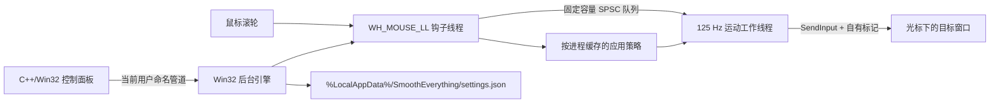

# SmoothEverything

SmoothEverything 是一个面向 Windows 10/11 的原生滚轮平滑工具。它以低延迟 Win32 后台引擎捕获传统鼠标滚轮输入，在独立工作线程中生成 125 Hz 平滑帧，并提供原生 C++/Win32 控制面板管理手感、应用规则和诊断信息。

当前版本：`0.1.2`（x64 预览版）。

## 已实现

- 全局纵向与横向滚轮平滑，Shift + 滚轮可转为横向滚动。
- 五次平滑曲线、距离、动画时长、连续滚动加速和长尾比例调节。
- 反向输入立即取消旧动量，鼠标跨窗口时取消当前手势。
- 按可执行文件名排除应用，或为应用保存独立运动参数和兼容模式。
- Ctrl / Alt 组合键放行，以及高分辨率小增量输入放行。
- 当前用户登录启动、通知区域菜单和 `Ctrl + Alt + S` 快速开关。
- 原生 Win32 控制面板：主页、应用规则、高级选项、实时诊断。
- 同一用户可访问的命名管道热更新；配置采用原子替换保存。
- 队列溢出、目标不可访问或输入注入失败时直接放行原始滚动。

SmoothEverything 不扫描、不检测、也不会终止其他滚动软件。若同时运行多个全局滚动工具，效果可能叠加，应由用户自行选择运行组合。

## 架构



钩子回调只做常数时间判断、缓存读取和入队；进程路径解析、曲线采样、计时与 `SendInput` 均在钩子线程之外完成。详见 [架构说明](docs/architecture.md)。

## 构建

要求：Windows 10 2004 或更高版本、PowerShell 7、Scoop。所有需要安装的工具链均通过 Scoop：

```powershell
pwsh .\scripts\Setup-Toolchain.ps1
pwsh .\scripts\Build.ps1 -Configuration Debug
```

如需生成安装程序，通过同一脚本使用 Scoop 安装 Inno Setup：

```powershell
pwsh .\scripts\Setup-Toolchain.ps1 -IncludeInstaller
```

发布无外部运行时依赖的 x64 安装程序和便携压缩包：

```powershell
pwsh .\scripts\Publish.ps1 -Version 0.1.2
```

输出位置：

- 原生构建：`artifacts/build/<debug|release>`
- 发布目录：`artifacts/publish/win-x64`
- 安装程序：`artifacts/SmoothEverything-Setup-<version>-x64.exe`
- 便携压缩包：`artifacts/SmoothEverything-<version>-win-x64.zip`
- 校验文件：`artifacts/SHA256SUMS.txt`

安装程序采用当前用户级安装，默认写入
`%LocalAppData%\Programs\SmoothEverything`，不触发管理员权限申请。卸载时会移除
SmoothEverything 的登录启动项，但保留 `%LocalAppData%\SmoothEverything` 中的用户配置。

## 自动发布

`main` 和拉取请求会运行 `.github/workflows/ci.yml`。推送格式为
`vMAJOR.MINOR.PATCH` 的标签后，`.github/workflows/release.yml` 会在 Windows Runner
上通过 Scoop 准备工具链，执行构建与测试，并自动上传安装程序、便携包和 SHA-256
校验文件：

```powershell
git tag -a v0.1.2 -m "SmoothEverything v0.1.2"
git push origin v0.1.2
```

也可以从 GitHub Actions 页面手动运行 Release 工作流，并选择一个已经存在的版本标签。

## 运行

正常使用建议运行安装程序，然后从开始菜单启动 SmoothEverything。便携使用时，在同一发布目录中运行 `SmoothEverything.ControlPanel.exe`。如果后台引擎不在线，控制面板会启动同目录的 `SmoothEverything.Engine.exe`；也可以直接运行引擎并从通知区域打开控制面板。

配置文件位于：

```text
%LocalAppData%\SmoothEverything\settings.json
```

配置字段说明见 [配置说明](docs/configuration.md)。

## 安全与平台边界

- 默认不申请管理员权限，不安装驱动或系统服务。
- 只处理当前交互用户会话；不会作用于登录界面、UAC 安全桌面或 BitLocker/TPM 预启动环境。
- 受 Windows UIPI 完整性级别限制，普通权限进程不能可靠注入管理员权限窗口；此时采用放行策略。
- 鼠标事件、窗口句柄和 RSSI 类似的环境信号都不是身份凭证；本项目不把滚轮输入用于任何认证目的。
- 当前发布物未签名，只建议在可审查的本地构建或测试环境使用。

## 当前限制

- 仅构建和验证 x64。
- 高分辨率设备判断目前基于滚轮增量小于 `WHEEL_DELTA` 的保守启发式，而不是厂商或设备白名单。
- 第一次遇到未缓存的目标进程时，该次滚轮事件会原样放行；路径解析完成后才应用对应策略。
- 预览版暂不提供代码签名或自动更新；安装程序和可执行文件会触发 Windows 的未知发布者提示。
